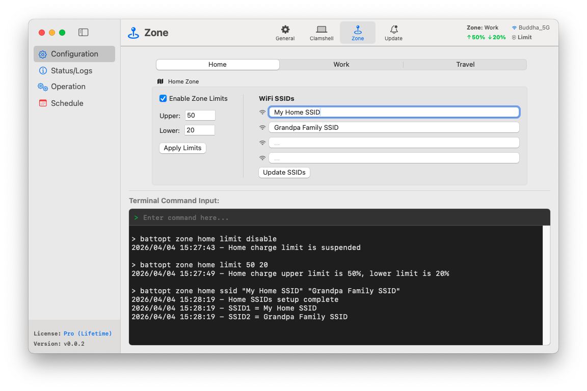

<p align="center">
	<a href="https://battopt.buddha-path.top">
  		
  	</a>
</p>

<h1 align="center">BattOpt</h1>

<p align="center">
  <b>Hybrid GUI/CLI interface</b><br>
  Works for both Intel & Apple Silicon Macbooks
</p>

<p align="center">
  <a href="https://battopt.buddha-path.top">🌐 https://battopt.buddha-path.top</a> 
</p>


<p align="center">
  English | <a href="README_TW.md">中文</a> | <a href="README_JP.md">日本語</a> | <a href="README_KR.md">한국어</a> | <a href="README_ES.md">Español</a> | <a href="README_FR.md">Français</a> | <a href="README_DE.md">Deutsch</a> | <a href="README_IT.md">Italiano</a> | <a href="README_UA.md">Українська</a> | <a href="README_RU.md">Русский</a>
</p>

---

### 🌍 Snapshot &nbsp;&nbsp;[(More Snapshots)](https://battopt.buddha-path.top/manual.html)
**BattOpt** features a hybrid GUI/CLI design with location-based **Zone** settings to setup charge limits separately for Home, Work, and Travel.
[](https://battopt.buddha-path.top/manual.html)

---

## 🌟 Key Features

### 🛠 Hybrid Interaction
* **Intuitive GUI:** A clean, native interface for easy monitoring and setup.
* **Robust CLI:** Full control via macOS Terminal for power users and automation.
* **Apple-Notarized:** Verified by Apple for security and compatibility.

### ⚡ Versatile Charge Limiter
* **Charge Limiter:** Upper and lower limits to prevent high-voltage stress and frequent micro charging.
* **Event-Triggered Logic:** Operates only when capacity changes, keeping CPU idle most of the time.
* **Sleep & Shutdown:** Limits remain active during sleep and shutdown (macOS 14.6 and earlier).
* **Bootcamp:** Limiter is started before user login, making it work even in Bootcamp.

### 💻 Clamshell Mode
Convenient for users who use their MacBook as a desktop replacement.
* **Level 0:** Standard - Lid must be open for discharge or calibration.
* **Level 1:** Balanced - Allow discharge/calibration with the lid closed (external display will sleep).
* **Level 2:** Ultimate - External display stays active during discharge/calibration.

### 📍 Zone Awareness
Automatically switch charge limits based on your location (Home/Work/Travel).
* **Home/Work:** 🏠 Setup up to 4 WiFi SSIDs per zone to auto-switch charge limits.
* **Travel:** ✈️ A dedicated "loose" limit (e.g., 90%) for when you are on the go and need more capacity.

### 📅 Scheduled Smart Calibration
* **Full Cycle Automation:** Discharge to 15% → Charge to 100% → 1-hour rest → Discharge to limit.
* **Flexible Scheduling:** Setup routines based on fixed monthly days or weekday intervals.
* **Smart Resume:** Calibration automatically pauses if AC power is detached and resumes once reconnected.

### 🌡️ Safety
* **Overheat Protection:** Automatic charging suspension if the temperature exceeds specified threshold.

### 📊 Logging & Monitoring
BattOpt maintains persistent logs to help you track health trends:
* **Daily Log:** Records health percentage, cycle counts, and capacity.
* **Calibrate Log:** A dedicated history of all automated calibration attempts.

### 🌻 Superior Compatibility
| Component | Intel Macs | Apple Silicon (M1/M2/M3/M4) |
| :--- | :--- | :--- |
| **GUI** | macOS 11+ | macOS 11+ |
| **CLI** | macOS 10.12+ | macOS 11+ |

---

## 💎 Free vs. Pro

All users enjoy a **90-day free trial** of Pro features immediately after installation. No credit card required to start the trial.

| Feature | Free | Pro |
| :--- | :---: | :---: |
| **Charge Limiter** (Upper/Lower) | ✅ | ✅ |
| **Manual Calibration** | ✅ | ✅ |
| **Scheduled Calibration** | ✅ | ✅ |
| **Bootcamp & Reboot Support** | ✅ | ✅ |
| **Overheat Protection** | ✅ | ✅ |
| **Clamshell Mode Support** | ❌ | ✅ |
| **Zone Awareness** (Home/Work/Travel) | ❌ | ✅ |
| **Smart Resume Calibration** | ❌ | ✅ |

### 🚀 Upgrade to BattOpt Pro
Unlock the full potential of your MacBook battery management. 
**[Purchase & Activate Pro via Polar](https://polar.sh/checkout/polar_c_uaH8ALktJ3C6x6l1cfXhS1NXsAO8BA8WsLHuy1ubWUe)**
> *Note: Please verify all features meet your expectations before purchase.*

---

## 🚀 Installation

### Option 1: Direct Download (Recommended)
Download the latest `.dmg` installer from the [Releases Page](https://battopt.buddha-path.top/latest.html).

### Option 2: Homebrew 
```bash
brew install --cask js4jiang5/battopt/battopt
```

### For macOS10.12 - 10.15 users (CLI only)
```bash
curl -sSL "https://raw.githubusercontent.com/js4jiang5/BattOpt/main/install.sh" | bash
```

---

## ⚙️ Post-Installation Setup

To ensure BattOpt functions correctly, please adjust the following macOS settings:

### 1. Disable System Optimization
Avoid conflicts with native macOS battery management:
* Go to **System Settings > Battery > Battery Health**.
* Click the **ⓘ** icon, toggle **OFF** "Optimized Battery Charging" and set **Charge Limit** to **100%** for macOS 26.4 or higher.

### 2. Notification Configuration
To ensure you receive status alerts successfully:
* **System-wide:** Enable "Allow notifications when mirroring or sharing" in **System Settings > Notifications**.
* **For CLI Users:** Go to **System Settings > Notifications > Script Editor** and set the alert style to **Alerts**.
* **For GUI Users:** We recommend setting BattOpt notifications to **Alerts** for better visibility.

## 💻 Quick Start for CLI Users &nbsp;&nbsp;[(Full Usage)](https://battopt.buddha-path.top/manual#cli)
### ⚡ Basic Controls
```
battopt limit 80 20      # Set limits: stop at 80%, resume at 20%
battopt limit disable    # Disable limiter and charge to 100%
battopt status           # View current battery status and active limits
```
### 🔄 Calibration & Manual Power
```
battopt calibrate        # Start full calibration cycle
battopt calibrate stop   # Cancel active calibration
battopt discharge 50     # Force discharge to 50%
battopt charge 80        # Force charge to 80%
```
### 📅 Scheduling & Zones (Pro)
```
# Schedule calibration on the 6th and 21st at 21:30 every month
battopt schedule day 6 21 hour 21 minute 30 

# Define "Work" zone by Wi-Fi SSIDs and set custom limits
battopt zone work ssid "Office_5G" "Office_Guest"
battopt zone work limit 80 60
```
> *Note: These commands can be entered in the macOS Terminal or directly into the Command Input box within the BattOpt GUI.*
---

## 🤝 Contributing
Contributions, issues, and feature requests are welcome! Feel free to check the [issues page](https://github.com/js4jiang5/BattOpt/issues).

---

## 📜 License
Distributed under the MIT License. See `LICENSE` for more information.
> *Note: The BattOpt brand name and logo are proprietary assets. All rights reserved.*

## 📃 Disclaimer
BattOpt uses low-level system calls to manage your Mac's battery health. While extensively tested on M1 and older Intel MacBooks, it is provided "AS IS" without any warranty.
By using BattOpt, you acknowledge that you are doing so at your own risk. The developer shall not be held liable for any hardware damage or data loss resulting from the use of this software.
