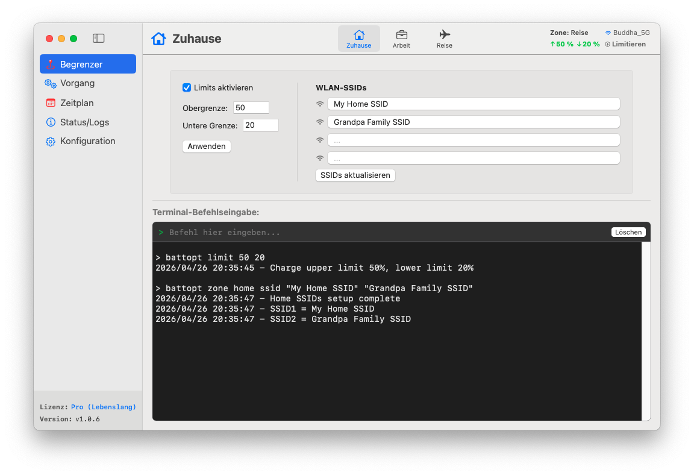

<p align="center">
	<a href="https://battopt.buddha-path.top">
  		
  	</a>
</p>

<h1 align="center">BattOpt</h1>

<p align="center">
  <b>Hybride GUI/CLI-Schnittstelle</b><br>
  Unterstützt sowohl Intel- als auch Apple Silicon Macbooks
</p>

<p align="center">
  <a href="https://battopt.buddha-path.top">🌐 https://battopt.buddha-path.top</a> 
</p>


<p align="center">
  <a href="README.md">English</a> | <a href="README_TW.md">中文</a> | <a href="README_JP.md">日本語</a> | <a href="README_KR.md">한국어</a> | <a href="README_ES.md">Español</a> | <a href="README_FR.md">Français</a> | Deutsch | <a href="README_IT.md">Italiano</a> | <a href="README_UA.md">Українська</a> | <a href="README_RU.md">Русский</a>
</p>

---

### 🌍 Vorschau &nbsp;[(Detailliertes Handbuch)](https://battopt.buddha-path.top/manual_de.html)
**BattOpt** bietet ein hybrides GUI/CLI-Design mit standortbasierten **Zonen-Einstellungen**, um Ladelimits separat für Zuhause, Arbeit und Reisen zu konfigurieren.
[](https://battopt.buddha-path.top/manual_de.html)

---

## 🌟 Hauptfunktionen

### 🛠 Hybride Interaktion
* **Intuitive GUI:** Eine saubere, native Benutzeroberfläche für einfache Überwachung und Konfiguration.
* **Leistungsstarke CLI:** Volle Kontrolle über das macOS-Terminal für fortgeschrittene Benutzer und Automatisierung.
* **Von Apple beglaubigt:** Von Apple auf Sicherheit und Kompatibilität geprüft.

### ⚡ Vielseitiger Ladebegrenzer
* **Ladelimits:** Passen Sie obere und untere Schwellenwerte an, um Hochspannungsstress und häufige Mikroladungen zu vermeiden.
* **Ereignisgesteuerte Logik:** Läuft nur bei Kapazitätsänderungen, wodurch die CPU-Auslastung nahezu bei Null bleibt.
* **Ruhezustand & Ausschalten:** Limits bleiben auch im Ruhezustand oder bei ausgeschaltetem System wirksam (effektiv unter macOS 14.6 und früher).
* **Bootcamp-Unterstützung:** Der Begrenzer startet vor der Benutzeranmeldung, was den Betrieb in Bootcamp-Umgebungen ermöglicht.

### 💻 Clamshell-Modus (Geschlossener Zustand)
Ideal für Benutzer, die ihr MacBook als Desktop-Ersatz verwenden:
* **Level 0: Standard** - Die Kappe muss geöffnet sein, um Entladungen oder Kalibrierungen durchzuführen.
* **Level 1: Ausgeglichen** - Ermöglicht Entladen/Kalibrieren bei geschlossener Kappe (externer Monitor geht im Entlademodus in den Ruhezustand).
* **Level 2: Ultimate** - Der externe Monitor bleibt während der Entladung/Kalibrierung aktiv.

### 📍 Zonenerkennung (Zone Awareness)
Wechselt automatisch die Ladelimits basierend auf Ihrem Standort (Zuhause/Arbeit/Reise).
* **Zuhause/Arbeit:** 🏠 Definieren Sie bis zu 4 WLAN-SSIDs pro Zone, um die Limits beim Verbinden automatisch umzuschalten.
* **Reisen:** ✈️ Ein lockereres Ladelimit (z. B. 90 %) für unterwegs, wenn Sie mehr Kapazität benötigen.

### 📅 Geplante intelligente Kalibrierung
* **Automatischer Vollzyklus:** Entladen auf 15 % → Laden auf 100 % → 1 Stunde Ruhezeit → Entladen auf das eingestellte Limit.
* **Flexible Planung:** Erstellen Sie Routinen basierend auf bestimmten Tagen im Monat oder wöchentlichen Intervallen.
* **Intelligente Fortsetzung:** Die Kalibrierung pausiert automatisch, wenn die Stromversorgung getrennt wird, und wird beim erneuten Anschließen fortgesetzt.

### 🌡️ Sicherheit
* **Überhitzungsschutz:** Stoppt den Ladevorgang automatisch, wenn die Batterietemperatur den angegebenen Schwellenwert überschreitet.

### 📊 Protokolle und Überwachung
BattOpt führt Protokolle, um den Zustand Ihrer Batterie zu verfolgen:
* **Tägliches Protokoll:** Zeichnet Gesundheitszustand (%), Zyklusanzahl und Kapazität auf.
* **Kalibrierungsprotokoll:** Separater Verlauf für alle automatischen Kalibrierungsversuche.

### 🌻 Hervorragende Kompatibilität
| Komponente | Intel-Macs | Apple Silicon (M1/M2/M3/M4) |
| :--- | :--- | :--- |
| **GUI** | macOS 11+ | macOS 11+ |
| **CLI** | macOS 10.12+ | macOS 11+ |

---

## 💎 Gratis vs. Pro

Alle Benutzer erhalten sofort nach der Installation eine **90-tägige kostenlose Testversion** der Pro-Funktionen. Für den Start ist keine Kreditkarte erforderlich.

| Funktion | Gratis | Pro |
| :--- | :---: | :---: |
| **Ladebegrenzer** (Max/Min) | ✅ | ✅ |
| **Manuelle Kalibrierung** | ✅ | ✅ |
| **Geplante Kalibrierung** | ✅ | ✅ |
| **Bootcamp- & Neustart-Support** | ✅ | ✅ |
| **Überhitzungsschutz** | ✅ | ✅ |
| **Clamshell-Modus-Support** | ❌ | ✅ |
| **Zonenerkennung** (Haus/Arbeit/Reise) | ❌ | ✅ |
| **Kalibrierung mit Fortsetzung** | ❌ | ✅ |

### 🚀 Upgrade auf BattOpt Pro
Nutzen Sie das volle Potenzial des Batteriemanagements Ihres MacBooks.
**[Pro über Polar kaufen und aktivieren](https://buy.polar.sh/polar_cl_6lBz0uWJ9HA3a3tyFR1op9x6WBNTqSoqF8tge0XNcgu)**
> *Hinweis: Bitte nutzen Sie den Testzeitraum, um vor dem Kauf zu bestätigen, dass alle Funktionen Ihren Erwartungen entsprechen.*

---

## 🚀 Installation

### Option 1: Direkter Download (Empfohlen)
Laden Sie das neueste `.dmg`-Installationsprogramm von der [Releases-Seite](https://battopt.buddha-path.top/latest.html) herunter.

### Option 2: Homebrew 
```bash
brew install --cask js4jiang5/battopt/battopt
```

### Für macOS 10.12 - 10.15 Benutzer (Nur CLI)
```bash
curl -sSL "[https://raw.githubusercontent.com/js4jiang5/BattOpt/main/install.sh](https://raw.githubusercontent.com/js4jiang5/BattOpt/main/install.sh)" | bash
```

---

## ⚙️ Einstellungen nach der Installation

Um sicherzustellen, dass BattOpt korrekt funktioniert, passen Sie bitte die folgenden macOS-Einstellungen an:

### 1. Systemoptimierung deaktivieren
Vermeiden Sie Konflikte mit dem nativen macOS-Batteriemanagement:
* Gehen Sie zu **Systemeinstellungen > Batterie > Batteriezustand**.
* Klicken Sie auf das **ⓘ**-Symbol, schalten Sie „**Optimiertes Laden der Batterie**“ **AUS** und setzen Sie das **Ladelimit** bei macOS 26.4 oder neuer auf **100 %**.

### 2. Mitteilungseinstellungen
Um Statuswarnungen korrekt zu erhalten:
* **Systemweit:** Aktivieren Sie "Mitteilungen beim Teilen oder Synchronisieren des Bildschirms erlauben" unter **Systemeinstellungen > Mitteilungen**.
* **CLI-Benutzer:** Gehen Sie zu **Systemeinstellungen > Mitteilungen > Skript-Editor** und setzen Sie den Hinweisstil auf **Hinweise**.
* **GUI-Benutzer:** Wir empfehlen, die BattOpt-Mitteilungen auf **Hinweise** zu setzen, um eine bessere Sichtbarkeit zu gewährleisten.

## 💻 Schnellstart für CLI-Benutzer &nbsp;&nbsp;[(Vollständige Nutzung)](https://battopt.buddha-path.top/manual_de#cli)
### ⚡ Grundlegende Steuerung
```
battopt limit 80 20      # Limits setzen: Stopp bei 80 %, Start bei 20 %
battopt limit disable    # Begrenzer deaktivieren und auf 100 % laden
battopt status           # Aktuellen Batteriestatus und aktive Limits anzeigen
```
### 🔄 Kalibrierung & Manuelle Steuerung
```
battopt calibrate        # Vollständigen Kalibrierungszyklus starten
battopt calibrate stop   # Aktive Kalibrierung abbrechen
battopt discharge 50     # Entladung auf 50 % erzwingen
battopt charge 80        # Ladung auf 80 % erzwingen
```
### 📅 Zeitplanung & Zonen (Pro)
```
# Kalibrierung am 6. und 21. jeden Monats um 21:30 Uhr planen
battopt schedule day 6 21 hour 21 minute 30 

# "Arbeit"-Zone über WLAN-SSIDs definieren und benutzerdefinierte Limits setzen
battopt zone work ssid "Office_5G" "Office_Guest"
battopt zone work limit 80 60
```
> *Hinweis: Diese Befehle können im macOS-Terminal oder direkt im Befehlseingabefeld der BattOpt-GUI eingegeben werden.*
---

## 🤝 Mitwirken
Beiträge, Fehlerberichte und Funktionsanfragen sind willkommen! Besuchen Sie gerne die [Issues-Seite](https://github.com/js4jiang5/BattOpt/issues).

---

## 📜 Lizenz
Verteilt unter der MIT-Lizenz. Weitere Details finden Sie in der Datei `LICENSE`.
> *Hinweis: Der Markenname BattOpt und das Logo sind geschützte Vermögenswerte. Alle Rechte vorbehalten.*

## 📃 Haftungsausschluss (Disclaimer)
BattOpt verwendet Low-Level-Systemaufrufe, um die Batterieleistung Ihres Macs zu verwalten. Obwohl es auf M1- und älteren Intel-MacBooks umfassend getestet wurde, wird es „WIE GESEHEN“ (AS IS) und ohne jegliche Gewährleistung bereitgestellt. Die Kompatibilität mit zukünftigen macOS-Updates oder aktualisierten Versionen wird nicht garantiert.
Durch die Nutzung von BattOpt erkennen Sie an, dass dies auf Ihr eigenes Risiko erfolgt. Der Entwickler haftet nicht für Hardware-Schäden, Datenverluste oder Systeminstabilitäten, die durch die Nutzung dieser Software entstehen.
