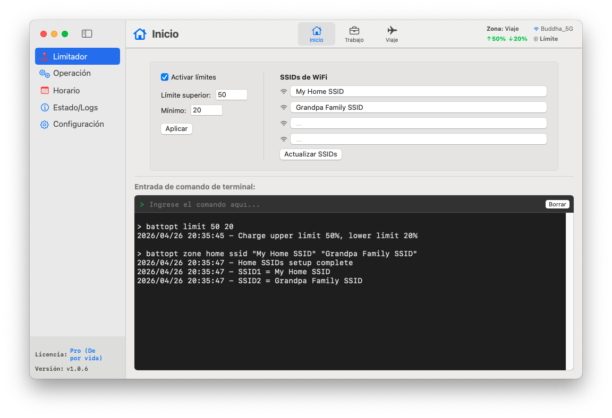

<p align="center">
	<a href="https://battopt.buddha-path.top">
  		
  	</a>
</p>

<h1 align="center">BattOpt</h1>

<p align="center">
  <b>Interfaz híbrida GUI/CLI</b><br>
  Compatible con Macbooks Intel y Apple Silicon
</p>

<p align="center">
  <a href="https://battopt.buddha-path.top">🌐 https://battopt.buddha-path.top</a> 
</p>


<p align="center">
  <a href="README.md">English</a> | <a href="README_TW.md">中文</a> | <a href="README_JP.md">日本語</a> | <a href="README_KR.md">한국어</a> | Español | <a href="README_FR.md">Français</a> | <a href="README_DE.md">Deutsch</a> | <a href="README_IT.md">Italiano</a> | <a href="README_UA.md">Українська</a> | <a href="README_RU.md">Русский</a>
</p>

---

### 🌍 Vista previa &nbsp;[(Manual detallado)](https://battopt.buddha-path.top/manual_es.html)
**BattOpt** presenta un diseño híbrido GUI/CLI con configuraciones de **Zonas** basadas en la ubicación para establecer límites de carga por separado para el Hogar, el Trabajo y los Viajes.
[](https://battopt.buddha-path.top/manual_es.html)

---

## 🌟 Características principales

### 🛠 Interacción híbrida
* **GUI intuitiva:** Una interfaz nativa limpia para un monitoreo y configuración sencillos.
* **CLI potente:** Control total desde la terminal de macOS para usuarios avanzados y automatización.
* **Notarizado por Apple:** Verificado por Apple para garantizar seguridad y compatibilidad.

### ⚡ Limitador de carga versátil
* **Límites de carga:** Personaliza los umbrales superior e inferior para evitar el estrés por alto voltaje y las microcargas frecuentes.
* **Lógica basada en eventos:** Solo se ejecuta cuando cambia la capacidad, manteniendo el uso de CPU casi nulo.
* **Soporte en reposo y apagado:** Los límites se mantienen efectivos incluso durante el reposo o cuando el sistema está apagado (efectivo en macOS 14.6 y anteriores).
* **Soporte para Bootcamp:** El limitador se inicia antes del inicio de sesión del usuario, lo que permite su funcionamiento en entornos Bootcamp.

### 💻 Modo de tapa cerrada (Clamshell)
Ideal para usuarios que utilizan su MacBook como reemplazo de escritorio:
* **Nivel 0: Estándar** - La tapa debe estar abierta para realizar descargas o calibraciones.
* **Nivel 1: Equilibrado** - Permite descarga/calibración con la tapa cerrada (la pantalla externa entra en reposo al descargar).
* **Nivel 2: Ultimate** - La pantalla externa permanece activa durante la descarga/calibración.

### 📍 Detección de zonas (Zone Awareness)
Cambia automáticamente los límites de carga según su ubicación (Hogar/Trabajo/Viaje).
* **Hogar/Trabajo:** 🏠 Define hasta 4 SSIDs de Wi-Fi por zona para cambiar los límites automáticamente al conectarse.
* **Viaje:** ✈️ Un límite de carga más flexible (ej. 90%) para cuando necesite más capacidad mientras se desplaza.

### 📅 Calibración inteligente programada
* **Ciclo completo automático:** Descarga al 15% → Carga al 100% → Reposo de 1 hora → Descarga hasta el límite establecido.
* **Programación flexible:** Establece rutinas basadas en días específicos del mes o intervalos semanales.
* **Reanudación inteligente:** La calibración se pausa automáticamente si se desconecta la energía y se reanuda al volver a conectar.

### 🌡️ Seguridad
* **Protección térmica:** Detiene la carga automáticamente si la temperatura de la batería supera el umbral especificado.

### 📊 Registros y monitoreo
BattOpt mantiene registros para rastrear las tendencias de salud de su batería:
* **Registro diario:** Registra el porcentaje de salud, el recuento de ciclos y la capacidad.
* **Registro de calibración:** Historial dedicado para todos los intentos de calibración automática.

### 🌻 Excelente compatibilidad
| Componente | Macs con Intel | Apple Silicon (M1/M2/M3/M4) |
| :--- | :--- | :--- |
| **GUI** | macOS 11+ | macOS 11+ |
| **CLI** | macOS 10.12+ | macOS 11+ |

---

## 💎 Gratis vs. Pro

Todos los usuarios disfrutan de una **prueba gratuita de 90 días** de las funciones Pro inmediatamente después de la instalación. No se requiere tarjeta de crédito para comenzar.

| Característica | Gratis | Pro |
| :--- | :---: | :---: |
| **Limitador de carga** (Máx/Mín) | ✅ | ✅ |
| **Calibración manual** | ✅ | ✅ |
| **Calibración programada** | ✅ | ✅ |
| **Soporte para Bootcamp y reinicio** | ✅ | ✅ |
| **Protección térmica** | ✅ | ✅ |
| **Soporte modo tapa cerrada** | ❌ | ✅ |
| **Detección de zonas** (Hogar/Trabajo/Viaje) | ❌ | ✅ |
| **Calibración con reanudación inteligente** | ❌ | ✅ |

### 🚀 Actualizar a BattOpt Pro
Desbloquee todo el potencial de la gestión de batería de su MacBook.
**[Comprar y activar Pro a través de Polar](https://buy.polar.sh/polar_cl_6lBz0uWJ9HA3a3tyFR1op9x6WBNTqSoqF8tge0XNcgu)**
> *Nota: Utilice el periodo de prueba para confirmar que todas las funciones cumplen con sus expectativas antes de comprar.*

---

## 🚀 Instalación

### Opción 1: Descarga directa (Recomendado)
Descargue el último instalador `.dmg` desde la [página de Lanzamientos](https://battopt.buddha-path.top/latest.html).

### Opción 2: Homebrew 
```bash
brew install --cask js4jiang5/battopt/battopt
```

### Para usuarios de macOS 10.12 - 10.15 (Solo CLI)
```bash
curl -sSL "[https://raw.githubusercontent.com/js4jiang5/BattOpt/main/install.sh](https://raw.githubusercontent.com/js4jiang5/BattOpt/main/install.sh)" | bash
```

---

## ⚙️ Configuración post-instalación

Para asegurar que BattOpt funcione correctamente, ajuste las siguientes configuraciones de macOS:

### 1. Desactivar la optimización del sistema
Evite conflictos con la gestión nativa de macOS:
* Vaya a **Ajustes del Sistema > Batería > Salud de la batería**.
* Haz clic en el icono **ⓘ**, **desactiva** la «**Recarga optimizada**» y establece el **Límite de carga** al **100%** para macOS 26.4 o superior.

### 2. Configuración de notificaciones
Para recibir alertas de estado correctamente:
* **Para todo el sistema:** Active "Permitir notificaciones al compartir o duplicar pantalla" en **Ajustes del Sistema > Notificaciones**.
* **Usuarios de CLI:** Vaya a **Ajustes del Sistema > Notificaciones > Editor de Scripts** y establezca el estilo de alerta en **Avisos**.
* **Usuarios de GUI:** Recomendamos establecer las notificaciones de BattOpt en **Avisos** para una mejor visibilidad.

## 💻 Inicio rápido para usuarios de CLI &nbsp;&nbsp;[(Uso completo)](https://battopt.buddha-path.top/manual_es#cli)
### ⚡ Controles básicos
```
battopt limit 80 20      # Establecer límites: parar al 80%, reanudar al 20%
battopt limit disable    # Desactivar limitador y cargar al 100%
battopt status           # Ver estado actual y límites activos
```
### 🔄 Calibración y alimentación manual
```
battopt calibrate        # Iniciar ciclo de calibración completo
battopt calibrate stop   # Cancelar calibración activa
battopt discharge 50     # Forzar descarga hasta el 50%
battopt charge 80        # Forzar carga hasta el 80%
```
### 📅 Programación y Zonas (Pro)
```
# Programar calibración los días 6 y 21 a las 21:30 cada mes
battopt schedule day 6 21 hour 21 minute 30 

# Definir zona "Trabajo" por SSIDs de Wi-Fi y establecer límites
battopt zone work ssid "Office_5G" "Office_Guest"
battopt zone work limit 80 60
```
> *Nota: Estos comandos pueden introducirse en la Terminal de macOS o directamente en el cuadro de comandos de la GUI de BattOpt.*
---

## 🤝 Contribuciones
¡Las contribuciones, problemas y solicitudes de funciones son bienvenidos! Siéntase libre de consultar la [página de problemas](https://github.com/js4jiang5/BattOpt/issues).

---

## 📜 Licencia
Distribuido bajo la licencia MIT. Consulte `LICENSE` para más detalles.
> *Nota: El nombre de la marca BattOpt y su logotipo son activos propios. Todos los derechos reservados.*

## 📃 Descargo de responsabilidad
BattOpt utiliza llamadas al sistema de bajo nivel para gestionar la salud de la batería de tu Mac. Aunque se ha probado exhaustivamente en MacBooks M1 e Intel antiguos, se proporciona "TAL CUAL" (AS IS) sin ninguna garantía, y no se garantiza el soporte para futuras versiones de macOS.
Al usar BattOpt, reconoces que lo haces bajo tu propio riesgo. El desarrollador no será responsable de ningún daño al hardware o pérdida de datos resultantes del uso de este software.