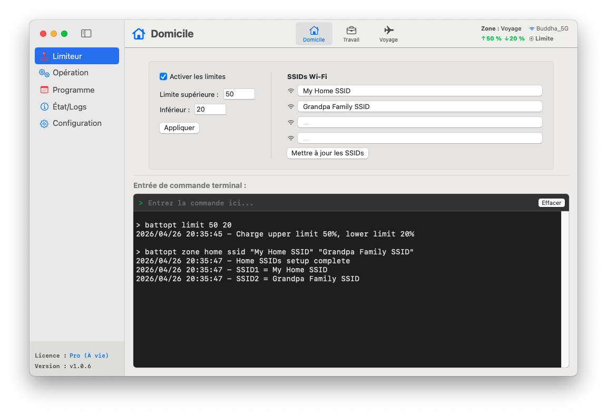

<p align="center">
	<a href="https://battopt.buddha-path.top">
  		
  	</a>
</p>

<h1 align="center">BattOpt</h1>

<p align="center">
  <b>Interface hybride GUI/CLI</b><br>
  Fonctionne sur les Macbooks Intel et Apple Silicon
</p>

<p align="center">
  <a href="https://battopt.buddha-path.top">🌐 https://battopt.buddha-path.top</a> 
</p>


<p align="center">
  <a href="README.md">English</a> | <a href="README_TW.md">中文</a> | <a href="README_JP.md">日本語</a> | <a href="README_KR.md">한국어</a> | <a href="README_ES.md">Español</a> | Français | <a href="README_DE.md">Deutsch</a> | <a href="README_IT.md">Italiano</a> | <a href="README_UA.md">Українська</a> | <a href="README_RU.md">Русский</a>
</p>

---

### 🌍 Aperçu &nbsp;[(Manuel détaillé)](https://battopt.buddha-path.top/manual_fr.html)
**BattOpt** propose une conception hybride GUI/CLI avec des paramètres de **Zones** basés sur la localisation pour configurer des limites de charge distinctes pour la Maison, le Travail et les Voyages.
[](https://battopt.buddha-path.top/manual_fr.html)

---

## 🌟 Caractéristiques principales

### 🛠 Interaction hybride
* **GUI intuitive :** Une interface native propre pour une surveillance et une configuration aisées.
* **CLI puissante :** Contrôle total depuis le terminal macOS pour les utilisateurs avancés et l'automatisation.
* **Notarisé par Apple :** Vérifié par Apple pour garantir la sécurité et la compatibilité.

### ⚡ Limiteur de charge polyvalent
* **Limites de charge :** Personnalisez les seuils supérieur et inférieur pour éviter le stress lié à la haute tension et les micro-charges fréquentes.
* **Logique basée sur les événements :** S'exécute uniquement lors du changement de capacité, maintenant l'utilisation du CPU à un niveau quasi nul.
* **Support veille et extinction :** Les limites restent effectives même pendant la veille ou lorsque le système est éteint (effectif sur macOS 14.6 et versions antérieures).
* **Support Bootcamp :** Le limiteur démarre avant la session utilisateur, permettant son fonctionnement sous Bootcamp.

### 💻 Mode capot fermé (Clamshell)
Idéal pour les utilisateurs utilisant leur MacBook comme un ordinateur de bureau :
* **Niveau 0 : Standard** - Le capot doit être ouvert pour effectuer des décharges ou des étalonnages.
* **Niveau 1 : Équilibré** - Autorise la décharge/étalonnage avec le capot fermé (l'écran externe s'endort lors de la décharge).
* **Niveau 2 : Ultimate** - L'écran externe reste actif pendant la décharge/étalonnage.

### 📍 Détection de zones (Zone Awareness)
Change automatiquement les limites de charge selon votre emplacement (Maison/Travail/Voyage).
* **Maison/Travail :** 🏠 Définissez jusqu'à 4 SSIDs Wi-Fi par zone pour basculer les limites automatiquement lors de la connexion.
* **Voyage :** ✈️ Une limite de charge plus souple (ex. 90 %) pour quand vous avez besoin de plus de capacité en déplacement.

### 📅 Étalonnage intelligent programmé
* **Cycle complet automatique :** Décharge à 15 % → Charge à 100 % → Repos d'une heure → Décharge jusqu'à la limite définie.
* **Programmation flexible :** Définissez des routines basées sur des jours spécifiques du mois ou des intervalles hebdomadaires.
* **Reprise intelligente :** L'étalonnage se met en pause automatiquement si l'alimentation est débranchée et reprend lors de la reconnexion.

### 🌡️ Sécurité
* **Protection thermique :** Arrête automatiquement la charge si la température de la batterie dépasse le seuil spécifié.

### 📊 Journaux et surveillance
BattOpt conserve des journaux pour suivre l'évolution de la santé de votre batterie :
* **Journal quotidien :** Enregistre le pourcentage de santé, le nombre de cycles et la capacité.
* **Journal d'étalonnage :** Historique dédié pour toutes les tentatives d'étalonnage automatique.

### 🌻 Excellente compatibilité
| Composant | Macs Intel | Apple Silicon (M1/M2/M3/M4) |
| :--- | :--- | :--- |
| **GUI** | macOS 11+ | macOS 11+ |
| **CLI** | macOS 10.12+ | macOS 11+ |

---

## 💎 Gratuit vs. Pro

Tous les utilisateurs bénéficient d'un **essai gratuit de 90 jours** des fonctions Pro immédiatement après l'installation. Aucune carte de crédit n'est requise pour commencer.

| Fonctionnalité | Gratuit | Pro |
| :--- | :---: | :---: |
| **Limiteur de charge** (Max/Min) | ✅ | ✅ |
| **Étalonnage manuel** | ✅ | ✅ |
| **Étalonnage programmé** | ✅ | ✅ |
| **Support Bootcamp et redémarrage** | ✅ | ✅ |
| **Protection thermique** | ✅ | ✅ |
| **Support mode capot fermé** | ❌ | ✅ |
| **Détection de zones** (Maison/Travail/Voyage) | ❌ | ✅ |
| **Étalonnage avec reprise intelligente** | ❌ | ✅ |

### 🚀 Passer à BattOpt Pro
Libérez tout le potentiel de la gestion de batterie de votre MacBook.
**[Acheter et activer Pro via Polar](https://polar.sh/checkout/polar_c_uaH8ALktJ3C6x6l1cfXhS1NXsAO8BA8WsLHuy1ubWUe)**
> *Note : Utilisez la période d'essai pour confirmer que toutes les fonctions répondent à vos attentes avant l'achat.*

---

## 🚀 Installation

### Option 1 : Téléchargement direct (Recommandé)
Téléchargez le dernier installateur `.dmg` depuis la [page des sorties (Releases)](https://battopt.buddha-path.top/latest.html).

### Option 2 : Homebrew 
```bash
brew install --cask js4jiang5/battopt/battopt
```

### Pour les utilisateurs de macOS 10.12 - 10.15 (CLI uniquement)
```bash
curl -sSL "[https://raw.githubusercontent.com/js4jiang5/BattOpt/main/install.sh](https://raw.githubusercontent.com/js4jiang5/BattOpt/main/install.sh)" | bash
```

---

## ⚙️ Configuration post-installation

Pour vous assurer que BattOpt fonctionne correctement, ajustez les réglages macOS suivants :

### 1. Désactiver l'optimisation du système
Évitez les conflits avec la gestion native de macOS :
* Allez dans **Réglages Système > Batterie > Santé de la batterie**.
* Cliquez sur l'icône **ⓘ**, **désactivez** la « **Recharge optimisée de la batterie** » et réglez la **Limite de recharge** sur **100 %** pour macOS 26.4 ou supérieur.

### 2. Réglages des notifications
Pour recevoir correctement les alertes d'état :
* **Pour tout le système :** Activez "Autoriser les notifications lors du partage ou de la recopie de l'écran" dans **Réglages Système > Notifications**.
* **Utilisateurs CLI :** Allez dans **Réglages Système > Notifications > Éditeur de script** et définissez le style d'alerte sur **Alertes**.
* **Utilisateurs GUI :** Nous recommandons de régler les notifications de BattOpt sur **Alertes** pour une meilleure visibilité.

## 💻 Démarrage rapide pour les utilisateurs CLI &nbsp;&nbsp;[(Usage complet)](https://battopt.buddha-path.top/manual_fr#cli)
### ⚡ Contrôles de base
```
battopt limit 80 20      # Définir limites : arrêt à 80%, reprise à 20%
battopt limit disable    # Désactiver limiteur et charger à 100%
battopt status           # Voir l'état actuel et les limites actives
```
### 🔄 Étalonnage et alimentation manuelle
```
battopt calibrate        # Démarrer cycle d'étalonnage complet
battopt calibrate stop   # Annuler l'étalonnage actif
battopt discharge 50     # Forcer décharge jusqu'à 50%
battopt charge 80        # Forcer charge jusqu'à 80%
```
### 📅 Programmation et Zones (Pro)
```
# Programmer étalonnage les 6 et 21 à 21h30 chaque mois
battopt schedule day 6 21 hour 21 minute 30 

# Définir zone "Travail" par SSIDs Wi-Fi et définir limites
battopt zone work ssid "Office_5G" "Office_Guest"
battopt zone work limit 80 60
```
> *Note : Ces commandes peuvent être saisies dans le Terminal macOS ou directement dans la zone de commande de l'interface GUI de BattOpt.*
---

## 🤝 Contributions
Les contributions, problèmes et demandes de fonctionnalités sont les bienvenus ! N'hésitez pas à consulter la [page des problèmes (Issues)](https://github.com/js4jiang5/BattOpt/issues).

---

## 📜 Licence
Distribué sous licence MIT. Voir le fichier `LICENSE` pour plus de détails.
> *Note : Le nom de marque BattOpt et son logo sont des actifs propriétaires. Tous droits réservés.*

## 📃 Avis de non-responsabilité
BattOpt utilise des appels système de bas niveau pour gérer la santé de la batterie de votre Mac. Bien qu'il ait été testé de manière approfondie sur les MacBook M1 et les anciens modèles Intel, il est fourni « EN L'ÉTAT » (AS IS) sans aucune garantie.
En utilisant BattOpt, vous reconnaissez que vous le faites à vos propres risques. Le développeur ne pourra être tenu responsable des dommages matériels ou des pertes de données résultant de l'utilisation de ce logiciel.