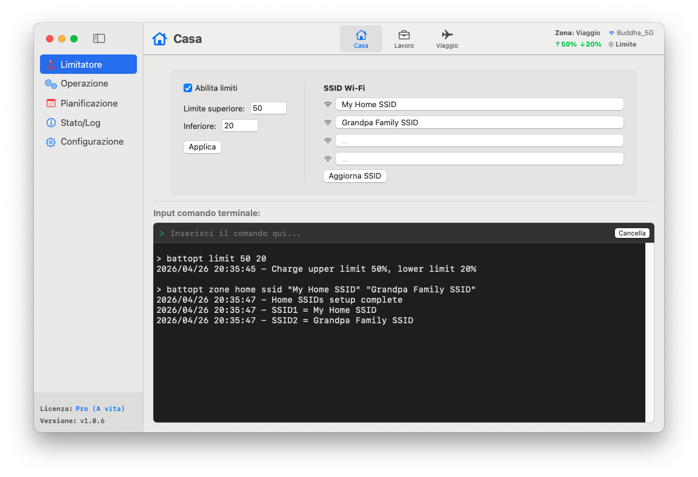

<p align="center">
	<a href="https://battopt.buddha-path.top">
  		
  	</a>
</p>

<h1 align="center">BattOpt</h1>

<p align="center">
  <b>Interfaccia ibrida GUI/CLI</b><br>
  Funziona su Macbook Intel e Apple Silicon
</p>

<p align="center">
  <a href="https://battopt.buddha-path.top">🌐 https://battopt.buddha-path.top</a> 
</p>


<p align="center">
  <a href="README.md">English</a> | <a href="README_TW.md">中文</a> | <a href="README_JP.md">日本語</a> | <a href="README_KR.md">한국어</a> | <a href="README_ES.md">Español</a> | <a href="README_FR.md">Français</a> | <a href="README_DE.md">Deutsch</a> | Italiano | <a href="README_UA.md">Українська</a> | <a href="README_RU.md">Русский</a>
</p>

---

### 🌍 Anteprima &nbsp;[(Manuale dettagliato)](https://battopt.buddha-path.top/manual_it.html)
**BattOpt** presenta un design ibrido GUI/CLI con impostazioni di **Zona** basate sulla posizione per configurare limiti di carica separati per Casa, Lavoro e Viaggio.
[](https://battopt.buddha-path.top/manual_it.html)

---

## 🌟 Caratteristiche principali

### 🛠 Interazione ibrida
* **GUI intuitiva:** Un'interfaccia nativa pulita per un monitoraggio e una configurazione semplici.
* **CLI potente:** Controllo totale dal terminale macOS per utenti avanzati e automazione.
* **Notaio Apple:** Verificato da Apple per garantire sicurezza e compatibilità.

### ⚡ Limitatore di carica versatile
* **Limiti di carica:** Personalizza le soglie superiore e inferiore per evitare lo stress da alta tensione e le micro-cariche frequenti.
* **Logica basata sugli eventi:** Funziona solo al cambio di capacità, mantenendo l'uso della CPU quasi nullo.
* **Supporto Stop e Spegnimento:** I limiti rimangono efficaci anche durante lo stop o quando il sistema è spento (efficace su macOS 14.6 e versioni precedenti).
* **Supporto Bootcamp:** Il limitatore si avvia prima del login utente, permettendone il funzionamento in ambienti Bootcamp.

### 💻 Modalità a coperchio chiuso (Clamshell)
Ideale per chi usa il MacBook come sostituto del desktop:
* **Livello 0: Standard** - Il coperchio deve essere aperto per eseguire scariche o calibrazioni.
* **Livello 1: Bilanciato** - Consente la scarica/calibrazione a coperchio chiuso (lo schermo esterno va in stop durante la scarica).
* **Livello 2: Ultimate** - Lo schermo esterno rimane attivo durante la scarica/calibrazione.

### 📍 Rilevamento zone (Zone Awareness)
Cambia automaticamente i limiti di carica in base alla tua posizione (Casa/Lavoro/Viaggio).
* **Casa/Lavoro:** 🏠 Definisci fino a 4 SSID Wi-Fi per zona per cambiare i limiti automaticamente alla connessione.
* **Viaggio:** ✈️ Un limite di carica più flessibile (es. 90%) per quando hai bisogno di più capacità in mobilità.

### 📅 Calibrazione intelligente programmata
* **Ciclo completo automatico:** Scarica al 15% → Carica al 100% → Stop di 1 ora → Scarica fino al limite impostato.
* **Programmazione flessibile:** Imposta routine basate su giorni specifici del mese o intervalli settimanali.
* **Ripresa intelligente:** La calibrazione si mette in pausa automaticamente se l'alimentazione viene scollegata e riprende alla riconnessione.

### 🌡️ Sicurezza
* **Protezione termica:** Interrompe automaticamente la carica se la temperatura della batteria supera la soglia specificata.

### 📊 Log e monitoraggio
BattOpt mantiene i log per tracciare le tendenze di salute della batteria:
* **Log giornaliero:** Registra la percentuale di salute, il conteggio dei cicli e la capacità.
* **Log di calibrazione:** Cronologia dedicata per tutti i tentativi di calibrazione automatica.

### 🌻 Ottima compatibilità
| Componente | Mac Intel | Apple Silicon (M1/M2/M3/M4) |
| :--- | :--- | :--- |
| **GUI** | macOS 11+ | macOS 11+ |
| **CLI** | macOS 10.12+ | macOS 11+ |

---

## 💎 Gratis vs. Pro

Tutti gli utenti godono di una **prova gratuita di 90 giorni** delle funzioni Pro immediatamente dopo l'installazione. Non è richiesta alcuna carta di credito per iniziare.

| Caratteristica | Gratis | Pro |
| :--- | :---: | :---: |
| **Limitatore di carica** (Max/Min) | ✅ | ✅ |
| **Calibrazione manual** | ✅ | ✅ |
| **Calibrazione programmata** | ✅ | ✅ |
| **Supporto Bootcamp e riavvio** | ✅ | ✅ |
| **Protezione termica** | ✅ | ✅ |
| **Supporto coperchio chiuso** | ❌ | ✅ |
| **Rilevamento zone** (Casa/Lavoro/Viaggio) | ❌ | ✅ |
| **Calibrazione con ripresa intelligente** | ❌ | ✅ |

### 🚀 Passa a BattOpt Pro
Sblocca tutto il potenziale della gestione batteria del tuo MacBook.
**[Acquista e attiva Pro tramite Polar](https://buy.polar.sh/polar_cl_6lBz0uWJ9HA3a3tyFR1op9x6WBNTqSoqF8tge0XNcgu)**
> *Nota: Ti invitiamo a usare il periodo di prova per confermare che tutte le funzioni soddisfino le tue aspettative prima dell'acquisto.*

---

## 🚀 Installazione

### Opzione 1: Download diretto (Consigliato)
Scarica l'ultimo installer `.dmg` dalla [pagina delle Release](https://battopt.buddha-path.top/latest.html).

### Opzione 2: Homebrew 
```bash
brew install --cask js4jiang5/battopt/battopt
```

### Per utenti macOS 10.12 - 10.15 (Solo CLI)
```bash
curl -sSL "[https://raw.githubusercontent.com/js4jiang5/BattOpt/main/install.sh](https://raw.githubusercontent.com/js4jiang5/BattOpt/main/install.sh)" | bash
```

---

## ⚙️ Configurazione post-installazione

Per assicurarti che BattOpt funzioni correttamente, regola le seguenti impostazioni di macOS:

### 1. Disattiva l'ottimizzazione di sistema
Evita conflitti con la gestione nativa di macOS:
* Vai in **Impostazioni di Sistema > Batteria > Stato della batteria**.
* Clicca sull'icona **ⓘ**, **disattiva** „**Caricamento ottimizzato**” e imposta il **Limite di caricamento** al **100%** per macOS 26.4 o versioni successive.

### 2. Impostazioni notifiche
Per ricevere correttamente gli avvisi di stato:
* **Per tutto il sistema:** Attiva "Consenti notifiche durante la condivisione o la duplicazione dello schermo" in **Impostazioni di Sistema > Notifiche**.
* **Utenti CLI:** Vai in **Impostazioni di Sistema > Notifiche > Editor Script** e imposta lo stile avviso su **Avvisi**.
* **Utenti GUI:** Consigliamo di impostare le notifiche di BattOpt su **Avvisi** per una migliore visibilità.

## 💻 Guida rapida per utenti CLI &nbsp;&nbsp;[(Uso completo)](https://battopt.buddha-path.top/manual_it#cli)
### ⚡ Controlli di base
```
battopt limit 80 20      # Imposta limiti: stop all'80%, ripresa al 20%
battopt limit disable    # Disattiva limitatore e carica al 100%
battopt status           # Visualizza lo stato attuale e i limiti attivi
```
### 🔄 Calibrazione e alimentazione manuale
```
battopt calibrate        # Avvia ciclo di calibrazione completo
battopt calibrate stop   # Annulla la calibrazione attiva
battopt discharge 50     # Forza la scarica fino al 50%
battopt charge 80        # Forza la carica fino all'80%
```
### 📅 Programmazione e Zone (Pro)
```
# Programma calibrazione il 6 e 21 alle 21:30 ogni mese
battopt schedule day 6 21 hour 21 minute 30 

# Definisci zona "Lavoro" tramite SSID Wi-Fi e imposta limiti
battopt zone work ssid "Office_5G" "Office_Guest"
battopt zone work limit 80 60
```
> *Nota: Questi comandi possono essere inseriti nel Terminale macOS o direttamente nella casella di comando della GUI di BattOpt.*
---

## 🤝 Contribuire
Contributi, segnalazioni di bug e richieste di funzionalità sono i benvenuti! Consulta la [pagina delle Issue](https://github.com/js4jiang5/BattOpt/issues).

---

## 📜 Licenza
Distribuito sotto licenza MIT. Vedi il file `LICENSE` per i dettagli.
> *Nota: Il nome del marchio BattOpt e il suo logo sono proprietà esclusiva. Tutti i diritti riservati.*

## 📃 Esclusione di responsabilità
BattOpt utilizza chiamate di sistema a basso livello per gestire lo stato della batteria del tuo Mac. Sebbene sia stato ampiamente testato su MacBook M1 e modelli Intel precedenti, viene fornito "COSÌ COM'È" (AS IS) senza alcuna garanzia, e il supporto per le future versioni di macOS non è garantito.
Utilizzando BattOpt, l'utente riconosce di farlo a proprio rischio. Lo sviluppatore non sarà ritenuto responsabile per eventuali danni all'hardware o perdita di dati derivanti dall'uso di questo software.
