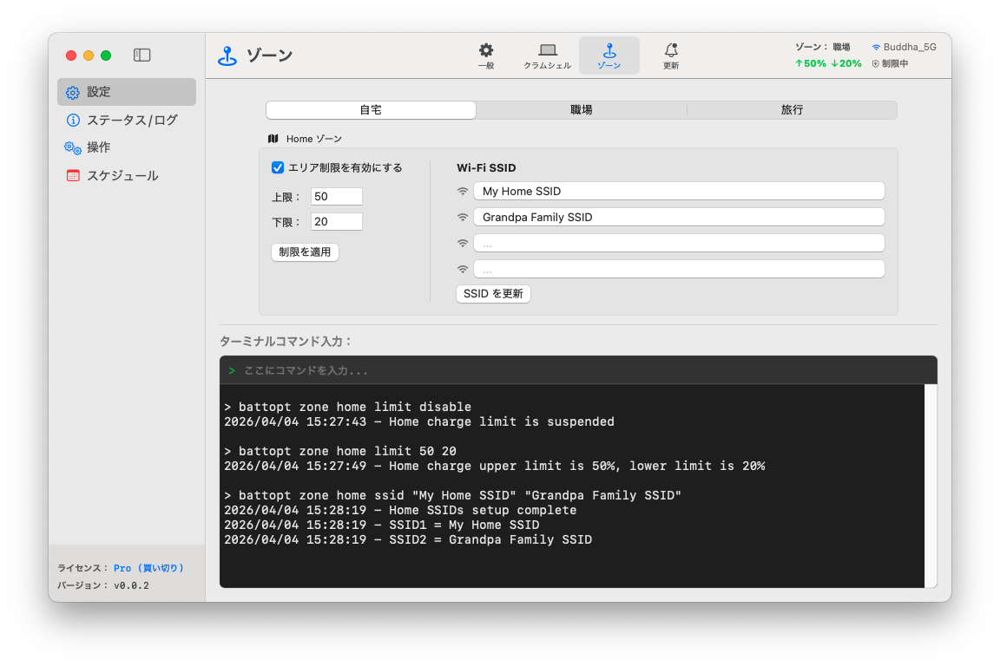

<p align="center">
	<a href="https://battopt.buddha-path.top">
  		
  	</a>
</p>

<h1 align="center">BattOpt</h1>

<p align="center">
  <b>GUI/CLI ハイブリッドインターフェース</b><br>
  Intel および Apple シリコン搭載 MacBook の両方に対応
</p>

<p align="center">
  <a href="https://battopt.buddha-path.top">🌐 https://battopt.buddha-path.top</a> 
</p>


<p align="center">
  <a href="README.md">English</a> | <a href="README_TW.md">中文</a> | 日本語 | <a href="README_KR.md">한국어</a> | <a href="README_ES.md">Español</a> | <a href="README_FR.md">Français</a> | <a href="README_DE.md">Deutsch</a> | <a href="README_IT.md">Italiano</a> | <a href="README_UA.md">Українська</a> | <a href="README_RU.md">Русский</a>
</p>

---

### 🌍 スクリーンショット &nbsp;[(詳細なマニュアル)](https://battopt.buddha-path.top/manual.html)
**BattOpt** は、直感的な GUI と強力な CLI を兼ね備えた設計になっています。場所に基づいた「**ゾーン設定**」により、自宅、職場、旅行先で個別に充電制限をセットアップできます。
[](https://battopt.buddha-path.top/manual.html)

---

## 🌟 主な機能

### 🛠 ハイブリッドな操作性
* **直感的な GUI：** 監視や設定が簡単に行える、クリーンなネイティブインターフェース。
* **強力な CLI：** パワーユーザーや自動化のために、macOS ターミナルからフルコントロールが可能。
* **Apple 公証済み：** セキュリティと互換性について Apple の検証を受けています。

### ⚡ 多彩な充電リミッター
* **充電制限：** 上限と下限をカスタマイズし、高電圧ストレスや頻繁な微小充電を防止します。
* **イベント駆動ロジック：** バッテリー残量が変化したときのみ動作するため、CPU の負荷を最小限に抑えます。
* **スリープ・システム終了時：** スリープ中や電源オフの状態でも制限が維持されます（macOS 14.6 以前で有効）。
* **Bootcamp 対応：** ユーザーログイン前にリミッターが起動するため、Bootcamp 環境でも動作します。

### 💻 クラムシェルモード
MacBook をデスクトップとして使用するユーザーに最適です。
* **レベル 0：標準** - 放電や校正（キャリブレーション）を行うには、上蓋を開けている必要があります。
* **レベル 1：バランス** - 上蓋を閉じた状態（クラムシェル）での放電/校正を許可します（放電時、外付けディスプレイはスリープします）。
* **レベル 2：究極** - 放電/校正中も、外付けディスプレイをアクティブなまま維持します。

### 📍 ゾーン感知 (Zone Awareness)
場所（自宅/職場/旅行）に応じて、充電制限を自動的に切り替えます。
* **自宅/職場：** 🏠 各ゾーンに最大 4 つの Wi-Fi SSID を設定でき、接続時に制限を自動適用します。
* **旅行：** ✈️ 外出先で容量が必要な場合に備え、専用の「緩い」制限（例：90%）を設定できます。

### 📅 スケジュール機能付きスマート校正
* **フルサイクル自動化：** 15% まで放電 → 100% まで充電 → 1 時間静置 → 設定した制限まで放電。
* **柔軟なスケジュール：** 毎月の特定の日付、または曜日の間隔に基づいたルーチンを設定可能。
* **スマートレジューム：** 電源アダプタが外れると校正を自動で一時停止し、再接続後に自動で再開します。

### 🌡️ セーフティ
* **過熱保護：** バッテリー温度が指定した閾値を超えると、自動的に充電を停止します。

### 📊 ログとモニタリング
BattOpt は、健康状態の傾向を把握するためのログを保持します。
* **日次ログ：** バッテリーの健康度（%）、サイクルカウント、容量を記録します。
* **校正ログ：** 自動校正の履歴を専用のログで管理します。

### 🌻 優れた互換性
| コンポーネント | Intel Mac | Apple シリコン (M1/M2/M3/M4) |
| :--- | :--- | :--- |
| **GUI** | macOS 11+ | macOS 11+ |
| **CLI** | macOS 10.12+ | macOS 11+ |

---

## 💎 Free vs. Pro

インストール直後から、すべてのユーザーが Pro 機能を **90 日間無料**で試用できます。試用の開始にクレジットカードは不要です。

| 機能 | 無料版 | Pro 版 |
| :--- | :---: | :---: |
| **充電リミッター** (上限/下限) | ✅ | ✅ |
| **手動校正** | ✅ | ✅ |
| **スケジュール校正** | ✅ | ✅ |
| **Bootcamp & 再起動対応** | ✅ | ✅ |
| **過熱保護** | ✅ | ✅ |
| **クラムシェルモード対応** | ❌ | ✅ |
| **ゾーン感知** (自宅/職場/旅行) | ❌ | ✅ |
| **スマートレジューム校正** | ❌ | ✅ |

### 🚀 BattOpt Pro へのアップグレード
MacBook のバッテリー管理を最大限に活用しましょう。
**[Polar 経由で Pro 版を購入・有効化する](https://polar.sh/checkout/polar_c_uaH8ALktJ3C6x6l1cfXhS1NXsAO8BA8WsLHuy1ubWUe)**
> *注：購入前に試用期間を利用して、すべての機能が期待通りであることをご確認ください。*

---

## 🚀 インストール

### 方法 1：直接ダウンロード (推奨)
[リリースページ](https://battopt.buddha-path.top/latest.html) から最新の `.dmg` インストーラーをダウンロードしてください。

### 方法 2：Homebrew 
```bash
brew install --cask js4jiang5/battopt/battopt
```

### macOS 10.12 - 10.15 ユーザー (CLI のみ)
```bash
curl -sSL "[https://raw.githubusercontent.com/js4jiang5/BattOpt/main/install.sh](https://raw.githubusercontent.com/js4jiang5/BattOpt/main/install.sh)" | bash
```

---

## ⚙️ インストール後の設定

BattOpt を正しく動作させるために、以下の macOS 設定を調整してください。

### 1. システムの最適化を無効化
macOS 標準のバッテリー管理との競合を避けます。
* **システム設定 > バッテリー > バッテリーの状態** へ移動します。
* **ⓘ** アイコンをクリックし、「**最適化されたバッテリー充電**」を **オフ** にします。

### 2. 通知の設定
ステータスアラートを確実に受け取るために：
* **システム全体：** **システム設定 > 通知** で「画面のミラーリング中または共有中に通知を許可」を有効にします。
* **CLI ユーザー：** **システム設定 > 通知 > スクリプトエディタ** で、通知スタイルを「**警告**」に設定します。
* **GUI ユーザー：** 視認性を高めるため、BattOpt の通知スタイルを「**警告**」に設定することをお勧めします。

## 💻 CLI ユーザー向けクイックスタート &nbsp;&nbsp;[(詳細な使い方)](https://battopt.buddha-path.top/manual_jp#cli)
### ⚡ 基本操作
```
battopt limit 80 20      # 制限設定：80% で停止、20% で再開
battopt limit disable    # リミッター無効化（100% まで充電）
battopt status           # 現在のバッテリー状態と有効な制限を確認
```
### 🔄 校正と手動電源操作
```
battopt calibrate        # フル校正サイクルを開始
battopt calibrate stop   # 実行中の校正を中止
battopt discharge 50     # 50% まで強制放電
battopt charge 80        # 80% まで強制充電
```
### 📅 スケジュールとゾーン (Pro)
```
# 毎月 6 日と 21 日の 21:30 に校正をスケジュール
battopt schedule day 6 21 hour 21 minute 30 

# Wi-Fi SSID で「職場」ゾーンを定義し、カスタム制限を設定
battopt zone work ssid "Office_5G" "Office_Guest"
battopt zone work limit 80 60
```
> *注：これらのコマンドは macOS ターミナルに入力するか、BattOpt GUI 内のコマンド入力ボックスに直接入力できます。*
---

## 🤝 貢献
貢献、Issue の報告、機能のリクエストは大歓迎です！[Issues ページ](https://github.com/js4jiang5/BattOpt/issues) をご確認ください。

---

## 📜 ライセンス
MIT ライセンスの下で配布されています。詳細は `LICENSE` をご覧ください。
> *注：BattOpt のブランド名およびロゴは専有資産です。無断転載を禁じます。*

## 📃 免責事項
BattOpt は、Mac のバッテリー状態を管理するために低レベルのシステムコールを使用しています。M1 および旧型の Intel MacBook で広範囲にわたるテストを実施済みですが、本ソフトウェアは「現状のまま (AS IS)」提供され、いかなる保証も行いません。
BattOpt を使用することで、利用者は自己の責任においてこれを行うことを承認したものとみなされます。開発者は、本ソフトウェアの使用に起因するハードウェアの損傷やデータの損失について、一切の責任を負いません。