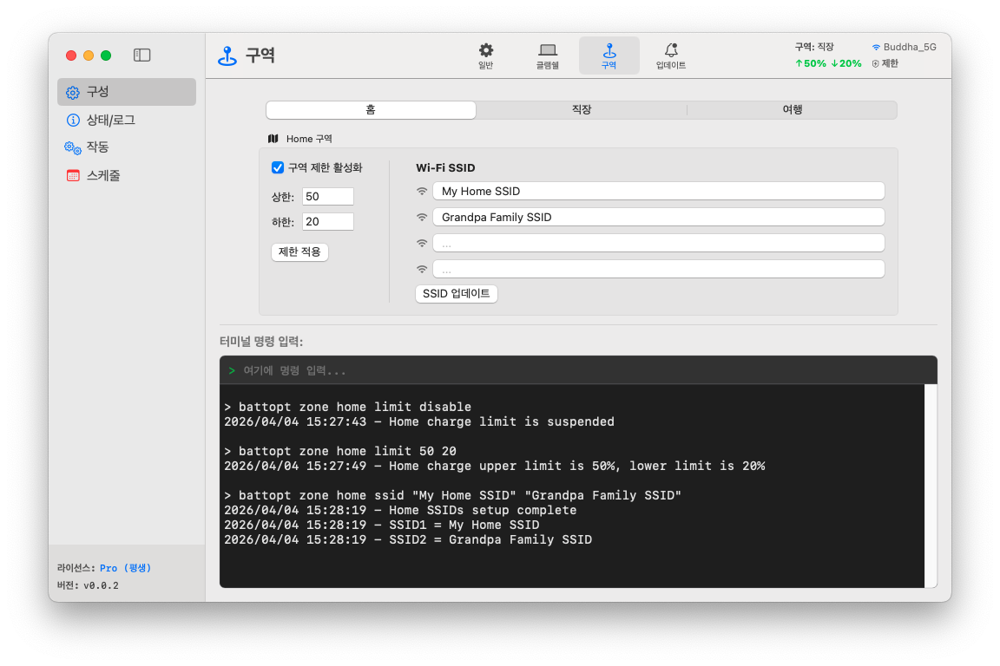

<p align="center">
	<a href="https://battopt.buddha-path.top">
  		
  	</a>
</p>

<h1 align="center">BattOpt</h1>

<p align="center">
  <b>GUI/CLI 하이브리드 인터페이스</b><br>
  Intel 및 Apple Silicon MacBook 모두 지원
</p>

<p align="center">
  <a href="https://battopt.buddha-path.top">🌐 https://battopt.buddha-path.top</a> 
</p>


<p align="center">
  <a href="README.md">English</a> | <a href="README_TW.md">中文</a> | <a href="README_JP.md">日本語</a> | 한국어 | <a href="README_ES.md">Español</a> | <a href="README_FR.md">Français</a> | <a href="README_DE.md">Deutsch</a> | <a href="README_IT.md">Italiano</a> | <a href="README_UA.md">Українська</a> | <a href="README_RU.md">Русский</a>
</p>

---

### 🌍 스크린샷 &nbsp;[(상세 매뉴얼)](https://battopt.buddha-path.top/manual.html)
**BattOpt**는 직관적인 GUI와 강력한 CLI를 결합한 설계를 갖추고 있습니다. 위치 기반 **영역(Zone)** 설정을 통해 집, 직장, 여행지에 따라 충전 제한을 별도로 구성할 수 있습니다.
[](https://battopt.buddha-path.top/manual.html)

---

## 🌟 주요 기능

### 🛠 하이브리드 상호작용
* **직관적인 GUI:** 모니터링과 설정이 간편한 깔끔한 네이티브 인터페이스를 제공합니다.
* **강력한 CLI:** 파워 유저와 자동화를 위해 macOS 터미널을 통한 전체 제어를 지원합니다.
* **Apple 공증 완료:** 보안 및 호환성에 대해 Apple의 검증을 받았습니다.

### ⚡ 다재다능한 충전 제한기
* **충전 제한:** 상한 및 하한을 설정하여 고전압 스트레스와 빈번한 미세 충전을 방지합니다.
* **이벤트 트리거 로직:** 배터리 용량이 변할 때만 작동하여 CPU 부하를 최소화합니다.
* **잠자기 및 종료 지원:** 잠자기 또는 시스템 종료 상태에서도 제한이 유지됩니다 (macOS 14.6 및 이전 버전).
* **Bootcamp 지원:** 사용자 로그인 전에 제한기가 시작되어 Bootcamp 환경에서도 작동합니다.

### 💻 클람쉘 모드 (Clamshell Mode)
MacBook을 데스크탑 대용으로 사용하는 사용자에게 유용합니다.
* **Level 0: 표준** - 방전 또는 보정을 수행하려면 덮개를 열어두어야 합니다.
* **Level 1: 균형** - 덮개를 닫은 상태에서 방전/보정을 허용합니다 (방전 시 외장 디스플레이는 잠자기 모드로 전환됨).
* **Level 2: 최고 성능** - 방전/보정 중에도 외장 디스플레이가 활성 상태로 유지됩니다.

### 📍 영역感知 (Zone Awareness)
위치(집/직장/여행)에 따라 충전 제한을 자동으로 전환합니다.
* **집/직장:** 🏠 영역당 최대 4개의 Wi-Fi SSID를 설정하여 충전 제한을 자동 전환합니다.
* **여행:** ✈️ 이동 중에 더 많은 용량이 필요할 때를 대비한 전용 "완화" 제한(예: 90%)을 설정할 수 있습니다.

### 📅 예약 스마트 보정
* **전체 사이클 자동화:** 15%까지 방전 → 100%까지 충전 → 1시간 휴식 → 설정된 제한까지 방전.
* **유연한 일정:** 매월 특정 날짜 또는 요일 간격을 기반으로 루틴을 설정할 수 있습니다.
* **스마트 재개:** 전원이 분리되면 보정이 자동으로 일시 중지되고, 다시 연결되면 자동으로 재개됩니다.

### 🌡️ 안전 기능
* **과열 보호:** 배터리 온도가 지정된 임계값을 초과하면 자동으로 충전을 중단합니다.

### 📊 로깅 및 모니터링
BattOpt는 배터리 건강 상태 추세를 추적할 수 있도록 로그를 유지합니다.
* **일일 로그:** 건강도(%), 사이클 수, 용량을 기록합니다.
* **보정 로그:** 자동 보정 시도에 대한 전용 이력을 관리합니다.

### 🌻 탁월한 호환성
| 구성 요소 | Intel Mac | Apple Silicon (M1/M2/M3/M4) |
| :--- | :--- | :--- |
| **GUI** | macOS 11+ | macOS 11+ |
| **CLI** | macOS 10.12+ | macOS 11+ |

---

## 💎 Free vs. Pro

설치 직후 모든 사용자는 Pro 기능을 **90일 동안 무료로 체험**할 수 있습니다. 체험 시작을 위해 신용카드 정보를 입력할 필요가 없습니다.

| 기능 | 무료 | Pro |
| :--- | :---: | :---: |
| **충전 제한기** (상한/하한) | ✅ | ✅ |
| **수동 보정** | ✅ | ✅ |
| **예약 보정** | ✅ | ✅ |
| **Bootcamp 및 재부팅 지원** | ✅ | ✅ |
| **과열 보호** | ✅ | ✅ |
| **클람쉘 모드 지원** | ❌ | ✅ |
| **영역感知** (집/직장/여행) | ❌ | ✅ |
| **스마트 재개 보정** | ❌ | ✅ |

### 🚀 BattOpt Pro로 업그레이드
MacBook 배터리 관리의 잠재력을 최대한 활용해 보세요.
**[Polar를 통해 Pro 구매 및 활성화](https://polar.sh/checkout/polar_c_uaH8ALktJ3C6x6l1cfXhS1NXsAO8BA8WsLHuy1ubWUe)**
> *참고: 구매 전試用 기간을 통해 모든 기능이 기대에 부합하는지 확인하시기 바랍니다.*

---

## 🚀 설치 방법

### 옵션 1: 직접 다운로드 (권장)
[Releases 페이지](https://battopt.buddha-path.top/latest.html)에서 최신 `.dmg` 설치 파일을 다운로드하세요.

### 옵션 2: Homebrew 
```bash
brew install --cask js4jiang5/battopt/battopt
```

### macOS 10.12 - 10.15 사용자 (CLI 전용)
```bash
curl -sSL "[https://raw.githubusercontent.com/js4jiang5/BattOpt/main/install.sh](https://raw.githubusercontent.com/js4jiang5/BattOpt/main/install.sh)" | bash
```

---

## ⚙️ 설치 후 설정

BattOpt가 올바르게 작동하려면 다음 macOS 설정을 조정해 주세요.

### 1. 시스템 최적화 비활성화
macOS 기본 배터리 관리 기능과의 충돌을 방지합니다.
* **시스템 설정 > 배터리 > 배터리 성능 상태**로 이동합니다.
* **ⓘ** 아이콘을 클릭하고 "**최적화된 배터리 충전**"을 **끔**으로 설정합니다.

### 2. 알림 설정
상태 알림을 성공적으로 받으려면 다음을 확인하세요.
* **시스템 전체:** **시스템 설정 > 알림**에서 "화면 미러링 또는 공유 중일 때 알림 허용"을 활성화합니다.
* **CLI 사용자:** **시스템 설정 > 알림 > 스크립트 편집기(Script Editor)**로 이동하여 알림 스타일을 **경고(Alerts)**로 설정합니다.
* **GUI 사용자:** 시인성을 위해 BattOpt 알림을 **경고(Alerts)**로 설정하는 것을 권장합니다.

## 💻 CLI 사용자 빠른 시작 &nbsp;&nbsp;[(전체 매뉴얼)](https://battopt.buddha-path.top/manual_kr#cli)
### ⚡ 기본 제어
```
battopt limit 80 20      # 제한 설정: 80%에서 정지, 20%에서 재개
battopt limit disable    # 제한기 비활성화 및 100%까지 충전
battopt status           # 현재 배터리 상태 및 활성 제한 확인
```
### 🔄 보정 및 수동 전원 제어
```
battopt calibrate        # 전체 보정 사이클 시작
battopt calibrate stop   # 진행 중인 보정 취소
battopt discharge 50     # 50%까지 강제 방전
battopt charge 80        # 80%까지 강제 충전
```
### 📅 예약 및 영역 (Pro)
```
# 매월 6일과 21일 21:30에 보정 예약
battopt schedule day 6 21 hour 21 minute 30 

# Wi-Fi SSID로 "직장(Work)" 영역을 정의하고 맞춤형 제한 설정
battopt zone work ssid "Office_5G" "Office_Guest"
battopt zone work limit 80 60
```
> *참고: 이 명령은 macOS 터미널에 입력하거나 BattOpt GUI의 명령 입력 상자에 직접 입력할 수 있습니다.*
---

## 🤝 기여하기
기여, 이슈 보고 및 기능 제안은 언제나 환영합니다! [Issues 페이지](https://github.com/js4jiang5/BattOpt/issues)를 확인해 주세요.

---

## 📜 라이선스
MIT 라이선스에 따라 배포됩니다. 자세한 내용은 `LICENSE`를 참조하세요.
> *참고: BattOpt 브랜드 이름과 로고는 독점 자산입니다. 모든 권리 보유.*

## 📃 면책 조항
BattOpt는 Mac의 배터리 상태를 관리하기 위해 저수준 시스템 호출을 사용합니다. M1 및 이전 Intel MacBook에서 광범위하게 테스트되었으나, 본 소프트웨어는 어떠한 보증 없이 "있는 그대로 (AS IS)" 제공됩니다.
BattOpt를 사용함으로써 귀하는 자신의 위험 부담 하에 이를 사용함을 인정합니다. 개발자는 이 소프트웨어의 사용으로 인해 발생하는 하드웨어 손상이나 데이터 손실에 대해 어떠한 책임도 지지 않습니다.