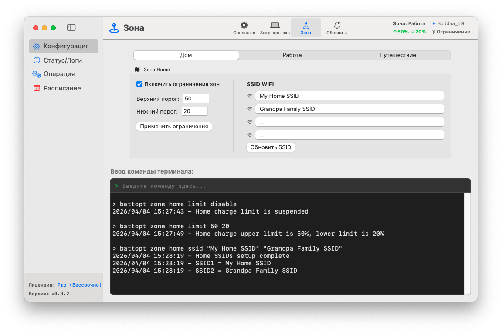

<p align="center">
	<a href="https://battopt.buddha-path.top">
  		
  	</a>
</p>

<h1 align="center">BattOpt</h1>

<p align="center">
  <b>Гибридный интерфейс GUI/CLI</b><br>
  Работает на Macbook с процессорами Intel и Apple Silicon
</p>

<p align="center">
  <a href="https://battopt.buddha-path.top">🌐 https://battopt.buddha-path.top</a> 
</p>


<p align="center">
  <a href="README.md">English</a> | <a href="README_TW.md">中文</a> | <a href="README_JP.md">日本語</a> | <a href="README_KR.md">한국어</a> | <a href="README_ES.md">Español</a> | <a href="README_FR.md">Français</a> | <a href="README_DE.md">Deutsch</a> | <a href="README_IT.md">Italiano</a> | <a href="README_UA.md">Українська</a> | Русский
</p>

---

### 🌍 Обзор &nbsp;[(Подробное руководство)](https://battopt.buddha-path.top/manual.html)
**BattOpt** имеет гибридный дизайн GUI/CLI с настройками **Зон** на основе местоположения, что позволяет устанавливать отдельные лимиты зарядки для Дома, Работы и Путешествий.
[](https://battopt.buddha-path.top/manual.html)

---

## 🌟 Основные возможности

### 🛠 Гибридное взаимодействие
* **Интуитивно понятный GUI:** Чистый нативный интерфейс для удобного мониторинга и настройки.
* **Мощный CLI:** Полный контроль через терминал macOS для продвинутых пользователей и автоматизации.
* **Нотариально заверен Apple:** Проверено Apple для гарантии безопасности и совместимости.

### ⚡ Универсальный ограничитель заряда
* **Лимиты зарядки:** Настраивайте верхний и нижний пороги, чтобы избежать износа от высокого напряжения и частых микрозарядок.
* **Логика на основе событий:** Работает только при изменении емкости, сводя использование процессора почти к нулю.
* **Поддержка сна и выключения:** Лимиты остаются в силе даже во время сна или когда система выключена (эффективно для macOS 14.6 и старше).
* **Поддержка Bootcamp:** Ограничитель запускается до входа пользователя в систему, что позволяет ему работать в среде Bootcamp.

### 💻 Режим закрытой крышки (Clamshell)
Идеально для пользователей, использующих MacBook как настольный компьютер:
* **Уровень 0: Стандартный** - Крышка должна быть открыта для выполнения разрядки или калибровки.
* **Уровень 1: Сбалансированный** - Разрешает разрядку/калибровку с закрытой крышкой (внешний монитор переходит в режим сна при разрядке).
* **Уровень 2: Максимальный** - Внешний монитор остается активным во время разрядки/калибровки.

### 📍 Распознавание зон (Zone Awareness)
Автоматически меняет лимиты зарядки в зависимости от вашего местоположения (Дом/Работа/Путешествие).
* **Дом/Работа:** 🏠 Определите до 4 Wi-Fi SSID на зону для автоматического переключения лимитов при подключении.
* **Путешествие:** ✈️ Специальный «мягкий» лимит (например, 90%) для случаев, когда вам нужно больше емкости в дороге.

### 📅 Интеллектуальная плановая калибровка
* **Автоматический полный цикл:** Разрядка до 15% → Зарядка до 100% → Покой в течение 1 часа → Разрядка до установленного лимита.
* **Гибкий график:** Устанавливайте рутину на основе конкретных дней месяца или еженедельных интервалов.
* **Умное возобновление:** Калибровка автоматически приостанавливается при отключении питания и возобновляется при повторном подключении.

### 🌡️ Безопасность
* **Тепловая защита:** Автоматически прекращает зарядку, если температура аккумулятора превышает указанный порог.

### 📊 Журналы и мониторинг
BattOpt ведет журналы для отслеживания тенденций состояния вашего аккумулятора:
* **Ежедневный журнал:** Фиксирует процент износа, количество циклов и емкость.
* **Журнал калибровки:** Отдельная история для всех попыток автоматической калибровки.

### 🌻 Отличная совместимость
| Компонент | Mac на Intel | Apple Silicon (M1/M2/M3/M4) |
| :--- | :--- | :--- |
| **GUI** | macOS 11+ | macOS 11+ |
| **CLI** | macOS 10.12+ | macOS 11+ |

---

## 💎 Бесплатная vs Pro

Все пользователи получают **90-дневную бесплатную пробную версию** функций Pro сразу после установки. Для начала работы кредитная карта не требуется.

| Функция | Бесплатная | Pro |
| :--- | :---: | :---: |
| **Ограничитель заряда** (Макс/Мин) | ✅ | ✅ |
| **Ручная калибровка** | ✅ | ✅ |
| **Плановая калибровка** | ✅ | ✅ |
| **Поддержка Bootcamp и перезагрузки** | ✅ | ✅ |
| **Тепловая защита** | ✅ | ✅ |
| **Поддержка режима закрытой крышки** | ❌ | ✅ |
| **Распознавание зон** (Дом/Работа/Путешествие) | ❌ | ✅ |
| **Калибровка с умным возобновлением** | ❌ | ✅ |

### 🚀 Обновить до BattOpt Pro
Раскройте полный потенциал управления аккумулятором вашего MacBook.
**[Купить и активировать Pro через Polar](https://polar.sh/checkout/polar_c_uaH8ALktJ3C6x6l1cfXhS1NXsAO8BA8WsLHuy1ubWUe)**
> *Примечание: Пожалуйста, воспользуйтесь пробным периодом, чтобы убедиться, что все функции соответствуют вашим ожиданиям перед покупкой.*

---

## 🚀 Установка

### Вариант 1: Прямая загрузка (Рекомендуется)
Загрузите последний установщик `.dmg` со [страницы релизов](https://battopt.buddha-path.top/latest.html).

### Вариант 2: Homebrew 
```bash
brew install --cask js4jiang5/battopt/battopt
```

### Для пользователей macOS 10.12 - 10.15 (только CLI)
```bash
curl -sSL "[https://raw.githubusercontent.com/js4jiang5/BattOpt/main/install.sh](https://raw.githubusercontent.com/js4jiang5/BattOpt/main/install.sh)" | bash
```

---

## ⚙️ Настройка после установки

Чтобы убедиться, что BattOpt работает правильно, отрегулируйте следующие настройки macOS:

### 1. Выключите системную оптимизацию
Избегайте конфликтов с родным управлением macOS:
* Перейдите в **Системные настройки > Аккумулятор > Состояние аккумулятора**.
* Нажмите иконку **ⓘ** и выключите «**Оптимизированная зарядка**».

### 2. Настройки уведомлений
Чтобы правильно получать предупреждения о состоянии:
* **Для всей системы:** Включите «Разрешить уведомления при общем доступе или дублировании экрана» в **Системных настройках > Уведомления**.
* **Пользователи CLI:** Перейдите в **Системные настройки > Уведомления > Редактор скриптов** и установите стиль уведомлений на **Предупреждения**.
* **Пользователи GUI:** Мы рекомендуем установить уведомления BattOpt на **Предупреждения** для лучшей видимости.

## 💻 Быстрый старт для пользователей CLI &nbsp;&nbsp;[(Полное руководство)](https://battopt.buddha-path.top/manual_ru#cli)
### ⚡ Основные команды
```
battopt limit 80 20      # Установить лимиты: стоп на 80%, старт на 20%
battopt limit disable    # Выключить ограничитель и зарядить до 100%
battopt status           # Просмотреть текущий статус и активные лимиты
```
### 🔄 Калибровка и ручное управление
```
battopt calibrate        # Запустить полный цикл калибровки
battopt calibrate stop   # Отменить активную калибровку
battopt discharge 50     # Принудительная разрядка до 50%
battopt charge 80        # Принудительная зарядка до 80%
```
### 📅 Расписание и Зоны (Pro)
```
# Запланировать калибровку на 6-е и 21-е число в 21:30 ежемесячно
battopt schedule day 6 21 hour 21 minute 30 

# Определить зону «Работа» по Wi-Fi SSID и установить свои лимити
battopt zone work ssid "Office_5G" "Office_Guest"
battopt zone work limit 80 60
```
> *Примечание: Эти команды можно вводить в терминале macOS или непосредственно в поле ввода команд в GUI BattOpt.*
---

## 🤝 Участие в проекте
Приветствуются любые вклады, сообщения об ошибках и запросы на новые функции! Заходите на [страницу issues](https://github.com/js4jiang5/BattOpt/issues).

---

## 📜 Лицензия
Распространяется по лицензии MIT. Подробности см. в файле `LICENSE`.
> *Примечание: Название бренда BattOpt и его логотип являются собственностью разработчика. Все права защищены.*

## 📃 Отказ от ответственности
BattOpt использует низкоуровневые системные вызовы для управления состоянием аккумулятора вашего Mac. Несмотря на тщательное тестирование на MacBook с процессорами M1 и более старых моделях Intel, программа предоставляется на условиях «КАК ЕСТЬ» (AS IS) без каких-либо гарантий.
Используя BattOpt, вы подтверждаете, что делаете это на свой страх и риск. Разработчик не несет ответственности за любое повреждение оборудования или потерю данных в результате использования данного программного обеспечения.