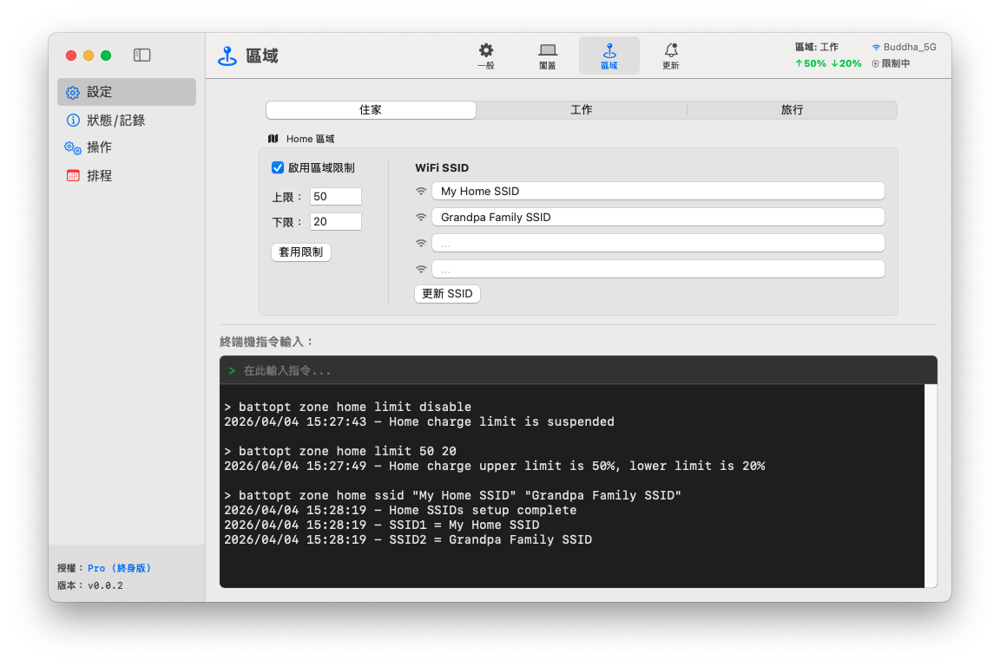

<p align="center">
	<a href="[https://battopt.buddha-path.top](https://battopt.buddha-path.top)">
  		
  	</a>
</p>

<h1 align="center">BattOpt</h1>

<p align="center">
  <b>GUI 與 CLI 雙介面設計</b><br>
  支援 Intel 與 Apple Silicon MacBook
</p>

<p align="center">
  <a href="https://battopt.buddha-path.top">🌐 https://battopt.buddha-path.top</a> 
</p>


<p align="center">
  <a href="README.md">English</a> | 中文 | <a href="README_JP.md">日本語</a> | <a href="README_KR.md">한국어</a> | <a href="README_ES.md">Español</a> | <a href="README_FR.md">Français</a> | <a href="README_DE.md">Deutsch</a> | <a href="README_IT.md">Italiano</a> | <a href="README_UA.md">Українська</a> | <a href="README_RU.md">Русский</a>
</p>

---

### 🌍 介面預覽 &nbsp;[(更多預覽)](https://battopt.buddha-path.top/manual_tw.html)
**BattOpt** 採用 GUI/CLI 雙介面設計，具備地點感知功能（**區域設定**），可針對「居家」、「工作」與「旅行」分別設定不同的充電限制。
[](https://battopt.buddha-path.top/manual_tw.html)

---

## 🌟 核心功能

### 🛠 雙重互動體驗
* **直覺式 GUI：** 簡潔的原生介面，方便監控與設定。
* **強大 CLI：** 提供終端機完整控制權，適合進階使用者與自動化。
* **Apple 公證：** 已通過 Apple 安全性與相容性驗證。

### ⚡ 全方位充電限制器
* **充電限制：** 自定義上限與下限，避免高電壓壓力與頻繁微幅充電。
* **事件驅動邏輯：** 僅在電量變化時執行，讓 CPU 在大多數時間保持閒置。
* **睡眠與關機：** 在睡眠與關機時限制依然有效（支援 macOS 14.6 及更早版本）。
* **Bootcamp：** 限制器在使用者登入前即啟動，使其在 Bootcamp 中也能運作。

### 💻 闔蓋模式 (Clamshell Mode)
適合將 MacBook 作為桌機替代方案的使用者：
* **Level 0：標準** - 必須開啟上蓋才能進行放電或校正。
* **Level 1：平衡** - 允許闔蓋放電/校正（放電時外接螢幕會進入睡眠）。
* **Level 2：極致** - 在放電/校正期間外接螢幕保持開啟狀態。

### 📍 區域感知 (Zone Awareness)
根據你的所在位置（居家/工作/旅行）自動切換充電限制。
* **居家/工作：** 🏠 每個區域可設定多達 4 組 Wi-Fi SSID，偵測到連線時自動切換限制。
* **旅行：** ✈️ 專屬的「寬鬆」限制（例如：90%），確保出門在外有足夠的續航力。

### 📅 排程智慧校正
* **全自動循環：** 放電至 15% → 充電至 100% → 靜置 1 小時 → 降回設定限制。
* **彈性排程：** 可根據每月固定日期或每週時間間隔設定例行程式。
* **智慧續傳：** 若中途拔除電源，校正會自動暫停，並在重新連線後恢復。

### 🌡️ 安全防護
* **過熱保護：** 當電池溫度超過指定閾值時，自動暫停充電。

### 📊 記錄與監控
BattOpt 提供持續性的記錄，協助您追蹤健康趨勢：
* **每日記錄：** 記錄健康百分比、循環次數與剩餘電量。
* **校正記錄：** 完整紀錄所有自動化校正嘗試的歷史。

### 🌻 優異相容性
| 組件 | Intel Macs | Apple Silicon (M1/M2/M3/M4) |
| :--- | :--- | :--- |
| **GUI** | macOS 11+ | macOS 11+ |
| **CLI** | macOS 10.12+ | macOS 11+ |

---

## 💎 免費版 vs. Pro 專業版

所有使用者在安裝後皆可立即享有 **90 天的 Pro 功能免費試用期**，無需信用卡即可開始。

| 功能 | 免費版 | Pro 專業版 |
| :--- | :---: | :---: |
| **充電限制器** (上限/下限) | ✅ | ✅ |
| **手動校正** | ✅ | ✅ |
| **排程校正** | ✅ | ✅ |
| **Bootcamp 與重啟支援** | ✅ | ✅ |
| **過熱保護** | ✅ | ✅ |
| **闔蓋模式支援** | ❌ | ✅ |
| **區域感知** (居家/工作/旅行) | ❌ | ✅ |
| **智慧續傳校正** | ❌ | ✅ |

### 🚀 升級至 BattOpt Pro
釋放 MacBook 電池管理的完整潛力。
**[點此透過 Polar 購買並啟用 Pro](https://polar.sh/checkout/polar_c_uaH8ALktJ3C6x6l1cfXhS1NXsAO8BA8WsLHuy1ubWUe)**
> *備註：購買前請先利用試用期確認所有功能符合您的預期。*

---

## 🚀 安裝方式

### 選項 1：直接下載（推薦）
從 [Releases 頁面](https://battopt.buddha-path.top/latest.html) 下載最新的 `.dmg` 安裝程式。

### 選項 2：Homebrew 
```bash
brew install --cask js4jiang5/battopt/battopt
```

### 針對 macOS 10.12 - 10.15 使用者（僅限 CLI）
```bash
curl -sSL "https://raw.githubusercontent.com/js4jiang5/BattOpt/main/install.sh" | bash
```

---

## ⚙️ 安裝後設定

為確保 BattOpt 運作正常，請調整以下 macOS 系統設定：

### 1. 停用系統內建優化
避免與 macOS 原生電池管理衝突：
* 前往 **系統設定 > 電池 > 電池健康度**。
* 點擊 **ⓘ** 圖示，將「**最佳化電池充電**」切換為 **關閉**。

### 2. 通知設定
確保您能成功收到狀態警示：
* **全系統：** 在 **系統設定 > 通知** 中啟用「鏡像輸出或共享螢幕時允許通知」。
* **CLI 使用者：** 前往 **系統設定 > 通知 > 工序指令編輯器 (Script Editor)**，將提示樣式設為「**提示框 (Alerts)**」。
* **GUI 使用者：** 建議將 BattOpt 的通知樣式設為「**提示框 (Alerts)**」以獲得最佳能見度。

## 💻 CLI 使用者快速入門 &nbsp;&nbsp;[(完整指令說明)](https://battopt.buddha-path.top/manual_tw#cli)
### ⚡ 基本控制
```
battopt limit 80 20      # 設定限制：80% 停止充電，20% 恢復充電
battopt limit disable    # 停用限制器，充電至 100%
battopt status           # 檢視目前電池狀態與生效中的限制
```
### 🔄 校正與手動電源管理
```
battopt calibrate        # 開始完整校正循環
battopt calibrate stop   # 取消進行中的校正
battopt discharge 50     # 強制放電至 50%
battopt charge 80        # 強制充電至 80%
```
### 📅 排程與區域 (Pro)
```
# 設定每月 6 號與 21 號的 21:30 進行校正
battopt schedule day 6 21 hour 21 minute 30 

# 透過 Wi-Fi SSID 定義「工作」區域並設定自定義限制
battopt zone work ssid "Office_5G" "Office_Guest"
battopt zone work limit 80 60
```
> *備註：以上指令可直接在 macOS 終端機輸入，或在 BattOpt GUI 的指令輸入框中使用。*
---

## 🤝 參與貢獻
歡迎任何形式的貢獻、問題回報 (Issues) 或新功能建議！請隨時查看 [Issues 頁面](https://github.com/js4jiang5/BattOpt/issues)。

---

## 📜 授權協議
本專案採用 MIT 授權協議。詳見 `LICENSE` 檔案。
> *備註：BattOpt 品牌名稱與標誌為專有資產，保留所有權利。*

## 📃 免責聲明
BattOpt 使用底層系統呼叫來管理您的 Mac 電池健康。雖然已在 M1 及較舊的 Intel MacBook 上經過廣泛測試，但本軟體仍以「現狀 (AS IS)」提供，不提供任何形式的保證。
使用 BattOpt 即表示您承認並同意自行承擔風險。開發者對於因使用本軟體而導致的任何硬體損壞或數據遺失概不負責。