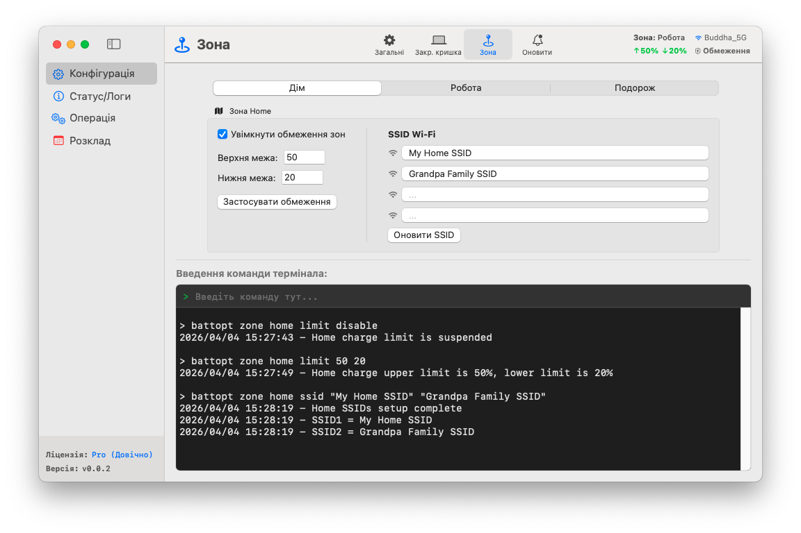

<p align="center">
	<a href="https://battopt.buddha-path.top">
  		
  	</a>
</p>

<h1 align="center">BattOpt</h1>

<p align="center">
  <b>Гібридний інтерфейс GUI/CLI</b><br>
  Працює на Macbook з процесорами Intel та Apple Silicon
</p>

<p align="center">
  <a href="https://battopt.buddha-path.top">🌐 https://battopt.buddha-path.top</a> 
</p>


<p align="center">
  <a href="README.md">English</a> | <a href="README_TW.md">中文</a> | <a href="README_JP.md">日本語</a> | <a href="README_KR.md">한국어</a> | <a href="README_ES.md">Español</a> | <a href="README_FR.md">Français</a> | <a href="README_DE.md">Deutsch</a> | <a href="README_IT.md">Italiano</a> | Українська | <a href="README_RU.md">Русский</a>
</p>

---

### 🌍 Огляд &nbsp;[(Докладний посібник)](https://battopt.buddha-path.top/manual_ua.html)
**BattOpt** має гібридний дизайн GUI/CLI з налаштуваннями **Зон** на основі розташування, що дозволяє встановлювати окремі ліміти заряджання для Дому, Роботи та Подорожей.
[](https://battopt.buddha-path.top/manual_ua.html)

---

## 🌟 Основні можливості

### 🛠 Гібридна взаємодія
* **Інтуїтивно зрозумілий GUI:** Чистий нативний інтерфейс для легкого моніторингу та налаштування.
* **Потужний CLI:** Повний контроль через термінал macOS для досвідчених користувачів та автоматизації.
* **Нотаріально завірено Apple:** Перевірено Apple для гарантії безпеки та сумісності.

### ⚡ Універсальний обмежувач заряду
* **Ліміти заряджання:** Налаштовуйте верхню та нижню межі, щоб уникнути стресу від високої напруги та частих мікрозаряджань.
* **Логіка на основі подій:** Працює лише при зміні ємності, що зводить використання процесора майже до нуля.
* **Підтримка сну та вимкнення:** Ліміти залишаються дійсними навіть під час сну або коли система вимкнена (ефективно для macOS 14.6 і старіших версій).
* **Підтримка Bootcamp:** Обмежувач запускається до входу користувача в систему, що дозволяє йому працювати в середовищі Bootcamp.

### 💻 Режим закритої кришки (Clamshell)
Ідеально для користувачів, які використовують MacBook як настільний комп'ютер:
* **Рівень 0: Стандартний** - Кришка має бути відкритою для виконання розряджання або калібрування.
* **Рівень 1: Збалансований** - Дозволяє розряджання/калібрування з закритою кришкою (зовнішній монітор переходить у режим сну під час розряджання).
* **Рівень 2: Максимальний** - Зовнішній монітор залишається активним під час розряджання/калібрування.

### 📍 Розпізнавання зон (Zone Awareness)
Автоматично змінює ліміти заряджання залежно від вашого розташування (Дім/Робота/Подорож).
* **Дім/Робота:** 🏠 Визначте до 4 Wi-Fi SSID на зону для автоматичного перемикання лімітів при підключенні.
* **Подорож:** ✈️ Спеціальний «м'який» ліміт (наприклад, 90%) для випадків, коли вам потрібно більше ємності в дорозі.

### 📅 Інтелектуальне планове калібрування
* **Автоматичний повний цикл:** Розряджання до 15% → Заряджання до 100% → Спокій протягом 1 години → Розряджання до встановленого ліміту.
* **Гнучкий графік:** Встановлюйте рутину на основі конкретних днів місяця або щотижневих інтервалів.
* **Розумне відновлення:** Калібрування автоматично призупиняється при відключенні живлення та відновлюється при повторному підключенні.

### 🌡️ Безпека
* **Тепловий захист:** Автоматично припиняє заряджання, якщо температура акумулятора перевищує вказаний поріг.

### 📊 Журнали та моніторинг
BattOpt веде журнали для відстеження тенденцій стану вашого акумулятора:
* **Щоденний журнал:** Фіксує відсоток справності, кількість циклів та ємність.
* **Журнал калібрування:** Окрема історія для всіх спроб автоматичного калібрування.

### 🌻 Відмінна сумісність
| Компонент | Mac на Intel | Apple Silicon (M1/M2/M3/M4) |
| :--- | :--- | :--- |
| **GUI** | macOS 11+ | macOS 11+ |
| **CLI** | macOS 10.12+ | macOS 11+ |

---

## 💎 Безкоштовна vs Pro

Усі користувачі отримують **90-денну безкоштовну пробну версію** функцій Pro відразу після встановлення. Для початку роботи кредитна картка не потрібна.

| Функція | Безкоштовна | Pro |
| :--- | :---: | :---: |
| **Обмежувач заряду** (Макс/Мін) | ✅ | ✅ |
| **Ручне калібрування** | ✅ | ✅ |
| **Планове калібрування** | ✅ | ✅ |
| **Підтримка Bootcamp та перезавантаження** | ✅ | ✅ |
| **Тепловий захист** | ✅ | ✅ |
| **Підтримка режиму закритої кришки** | ❌ | ✅ |
| **Розпізнавання зон** (Дім/Робота/Подорож) | ❌ | ✅ |
| **Калібрування з розумним відновленням** | ❌ | ✅ |

### 🚀 Оновити до BattOpt Pro
Розкрийте повний потенціал керування акумулятором вашого MacBook.
**[Купити та активувати Pro через Polar](https://polar.sh/checkout/polar_c_uaH8ALktJ3C6x6l1cfXhS1NXsAO8BA8WsLHuy1ubWUe)**
> *Примітка: Будь ласка, скористайтеся пробним періодом, щоб переконатися, що всі функції відповідають вашим очікуванням перед покупкою.*

---

## 🚀 Встановлення

### Варіант 1: Пряме завантаження (Рекомендовано)
Завантажте останній інсталятор `.dmg` зі [сторінки релізів](https://battopt.buddha-path.top/latest.html).

### Варіант 2: Homebrew 
```bash
brew install --cask js4jiang5/battopt/battopt
```

### Для користувачів macOS 10.12 - 10.15 (тільки CLI)
```bash
curl -sSL "[https://raw.githubusercontent.com/js4jiang5/BattOpt/main/install.sh](https://raw.githubusercontent.com/js4jiang5/BattOpt/main/install.sh)" | bash
```

---

## ⚙️ Налаштування після встановлення

Щоб переконатися, що BattOpt працює правильно, відкоригуйте наступні налаштування macOS:

### 1. Вимкніть системну оптимізацію
Уникайте конфліктів з рідним керуванням macOS:
* Перейдіть у **Системні параметри > Акумулятор > Стан акумулятора**.
* Натисніть іконку **ⓘ** та вимкніть «**Оптимізоване заряджання**».

### 2. Налаштування сповіщень
Щоб правильно отримувати попередження про стан:
* **Для всієї системи:** Увімкніть «Дозволити сповіщення під час поширення або дублювання екрана» у **Системні параметри > Сповіщення**.
* **Користувачі CLI:** Перейдіть у **Системні параметри > Сповіщення > Редактор скриптів** і встановіть стиль сповіщень на **Оголошення**.
* **Користувачі GUI:** Ми рекомендуємо встановити сповіщення BattOpt на **Оголошення** для кращої видимості.

## 💻 Швидкий старт для користувачів CLI &nbsp;&nbsp;[(Повний посібник)](https://battopt.buddha-path.top/manual_ua#cli)
### ⚡ Основні команди
```
battopt limit 80 20      # Встановити ліміти: зупинка на 80%, відновлення на 20%
battopt limit disable    # Вимкнути обмежувач і зарядити до 100%
battopt status           # Переглянути поточний стан акумулятора та активні ліміти
```
### 🔄 Калібрування та ручне керування
```
battopt calibrate        # Запустити повний цикл калібрування
battopt calibrate stop   # Скасувати активне калібрування
battopt discharge 50     # Примусове розряджання до 50%
battopt charge 80        # Примусове заряджання до 80%
```
### 📅 Розклад та Зони (Pro)
```
# Запланувати калібрування на 6-е та 21-е число о 21:30 щомісяця
battopt schedule day 6 21 hour 21 minute 30 

# Визначити зону «Робота» за Wi-Fi SSID та встановити власні ліміти
battopt zone work ssid "Office_5G" "Office_Guest"
battopt zone work limit 80 60
```
> *Примітка: Ці команди можна вводити в терміналі macOS або безпосередньо в поле введення команд у GUI BattOpt.*
---

## 🤝 Внесок у проєкт
Внески, повідомлення про помилки та запити на нові функції вітаються! Перейдіть на [сторінку issues](https://github.com/js4jiang5/BattOpt/issues).

---

## 📜 Ліцензія
Розповсюджується за ліцензією MIT. Дивіться файл `LICENSE` для докладної інформації.
> *Примітка: Назва бренду BattOpt та його логотип є власністю розробника. Усі права захищені.*

## 📃 Відмова від відповідальності
BattOpt використовує низькоуровневі системні виклики для керування станом акумулятора вашого Mac. Хоча програма була ретельно протестована на MacBook з процесорами M1 та старіших моделях Intel, вона надається на умовах «ЯК Є» (AS IS) без будь-яких гарантій.
Використовуючи BattOpt, ви підтверджуєте, що робите це на свій власний страх і ризик. Розробник не несе відповідальності за будь-яке пошкодження обладнання або втрату даних, що виникли внаслідок використання цього програмного забезпечення.